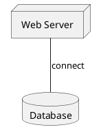

# Infrastructure Design Document

## User Request

**Original request:** AWS에 EC2와 RDS를 사용하는 웹 서비스를 구축해줘

## Architecture Diagram (PlantUML)

This document was automatically generated by the agent system.